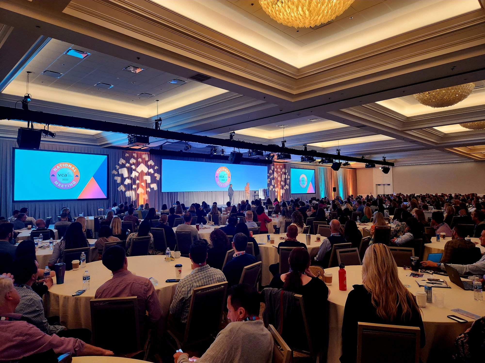
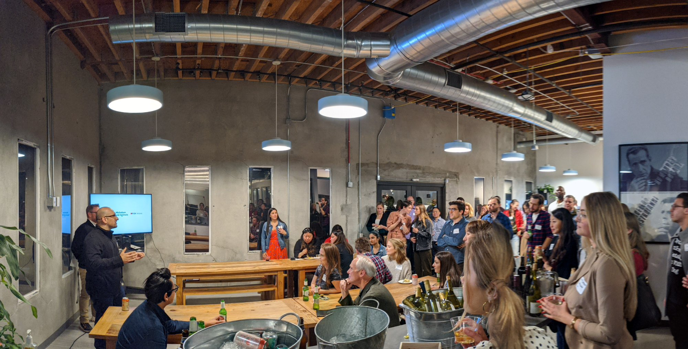
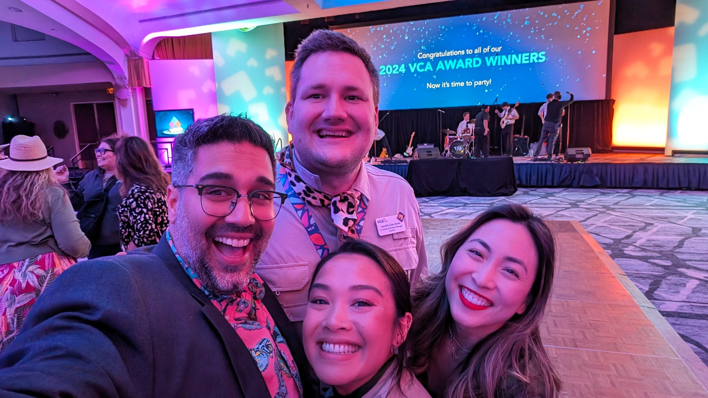
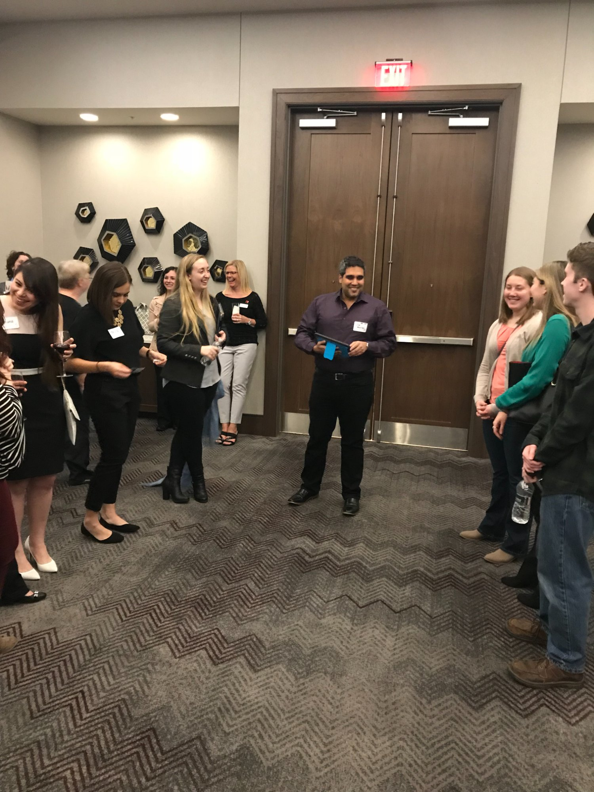
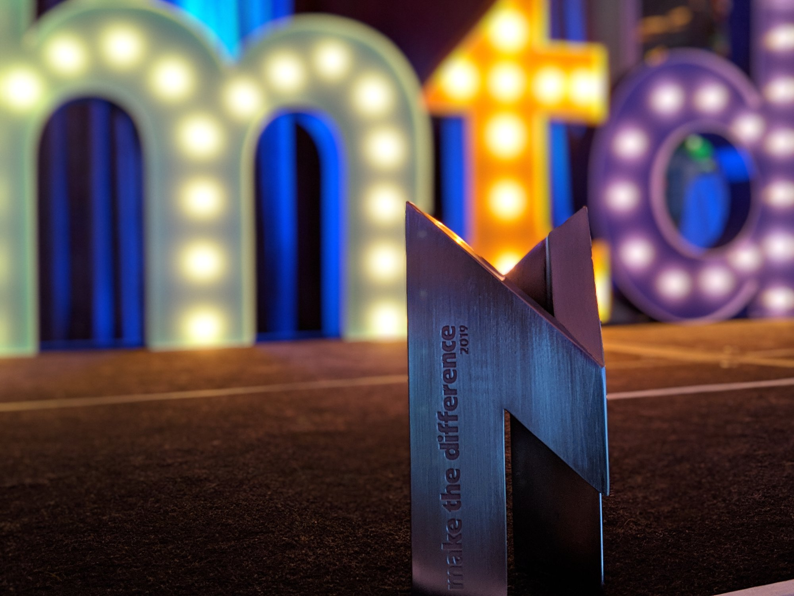
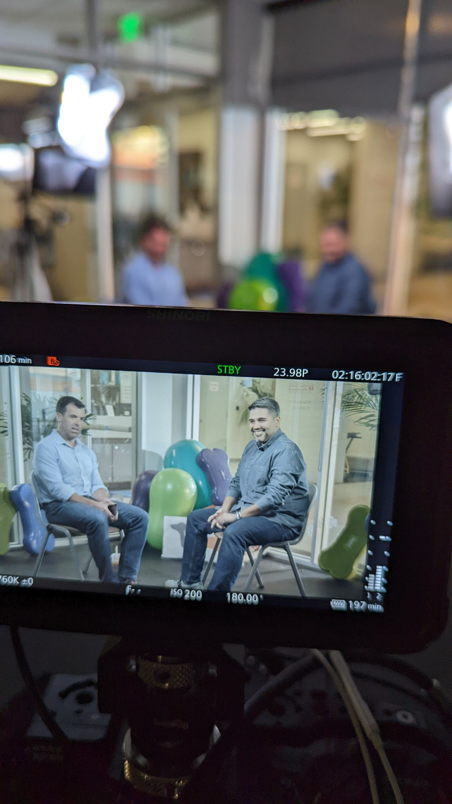

<html lang="en">
<head>
<meta charset="UTF-8">
<meta name="viewport" content="width=device-width, initial-scale=1.0">
<meta name="description" content="Ibrahim Al-Murjan. Global VP of Product. Building products, teams, and platforms from the ground up — scaled across 2,500+ locations worldwide.">
<meta name="format-detection" content="telephone=no, date=no, email=no, address=no">
<title>Ibrahim Al-Murjan | Global VP of Product</title>
<link rel="preconnect" href="https://fonts.googleapis.com">
<link rel="preconnect" href="https://fonts.gstatic.com" crossorigin>
<link href="https://fonts.googleapis.com/css2?family=Instrument+Serif:ital@0;1&family=DM+Sans:ital,opsz,wght@0,9..40,300;0,9..40,400;0,9..40,500;0,9..40,600;1,9..40,300;1,9..40,400&display=swap" rel="stylesheet">

</head>
<body>
<nav class="nv">
<a href="#" class="nl">abe.</a>
<a href="#about">About</a><a href="#portfolio">Portfolio</a><a href="#speaking">Speaking</a><a href="#experience">Experience</a><a href="#refs">References</a><a href="#contact" class="pl">Let's Connect</a>
<button class="nb" id="nb" aria-label="Menu"></button>
</nav>

<a href="#about">About</a><a href="#portfolio">Portfolio</a><a href="#speaking">Speaking</a><a href="#experience">Experience</a><a href="#refs">References</a><a href="#contact" class="pl">Let's Connect</a>

&times;

<section class="hr s">

Global VP of Product

<h1>Products, teams, and platforms that <em>scale</em></h1>

From building a business operations program that got me through the door, to scaling consumer apps, AI tools, and enterprise platforms across 2,500+ locations. Operations streamlined by an average of 30%, growth driven by 25%, and every product shipped with a clear return on investment.

<a href="#contact" class="bg">Let's Connect</a><a href="https://www.linkedin.com/in/abealmurjan/" target="_blank" class="bo">LinkedIn</a>

Award

Mars Global Innovation Winner

18+Years in Product

</section>

2M+Consumer App Users

1.5M+AI Dictations Processed

2,500+Locations Worldwide

4–200+Team Scale Range

<section id="about" class="s ab-sec">

Background

<h2 class="sh2">How the work <em>gets done</em></h2>

Got through the door by building a business operations program that streamlined workflows and turned a 30% revenue decline into 3% growth. That first engagement led to the next, and the one after that — each move earned by hitting KPIs, learning from mentors who set a high bar, and delivering measurable ROI that opened new doors.

That pattern scaled. From 4-person product pods to enterprise programs with 200+ contractors, the work has always been about reading the situation, building the right team for it, and shipping something that moves the number. Consumer apps, AI tools, operational platforms, payment systems — across industries and continents. Whether it's standing something up from zero or walking into a complex situation and finding a way through, the approach is the same.

&#9889;
<h4>0 to 1 Builds</h4>
Multiple products from concept to production when off-the-shelf didn't fit.

&#128208;
<h4>Team Design</h4>
From 4-person pods to 200+ contractor teams — sized and structured for the problem at hand.

&#8599;
<h4>Global Scale</h4>
Deployed across 2,500+ locations in North America, Europe, and Asia.

&#9673;
<h4>Complex Environments</h4>
Regulated industries, legacy systems, multi-stakeholder orgs. Built to navigate ambiguity.

</section>

<section id="portfolio" class="s pf">

Product Portfolio
<h2 class="sh2">What's been <em>shipped</em></h2>

<!-- Consumer App + Stripe Partnership -->

Stripe PartnershipStripe Sessions Opener
Consumer Mobile App &amp; Embedded Payments
<h3>Consumer Healthcare App &amp; Text to Pay</h3>
Consumer mobile app for a 1,000+ location veterinary network. Check-in, document signing, 24/7 care access, and an embedded payment gateway built in partnership with Stripe. Text to Pay powered $1B+ in digital payment collection across the network. The integration opened Stripe Sessions, the company's annual kickoff alongside cofounder Patrick Collison.

2M+Active Users

$1B+Payments via Stripe

4.8&#9733;App Store Rating

<!-- Stripe Sessions Video Callout -->

<video controls preload="metadata"><source src="stripe-sessions-keynote.mp4" type="video/mp4"></video>

Industry Partnership

<h3>Stripe Sessions Opener with Cofounder Patrick Collison</h3>

The embedded payment gateway opened Stripe Sessions alongside cofounder Patrick Collison. A real-world partnership with an industry leader to solve problems at scale and make experiences better for millions of people.

<a href="https://www.linkedin.com/posts/abealmurjan_vcalife-marspetcare-innovation-activity-6811062137931362304--vDX/" target="_blank">See the LinkedIn post &rarr;</a>

<!-- Telehealth -->

Virtual Care Platform
<h3>Telehealth &amp; Live Chat</h3>
In-app teletriage chat launched in 2018, expanded to full video and 24/7 access in 2020. Works across web and mobile, pulls real-time data from medical records. Available to 1M+ clients.

1M+Clients

24/7Access

4.8&#9733;Satisfaction

<!-- AI Medical Dictation -->

Built 0 to 1Proprietary IP
AI-Powered Internal Tool
<h3>AI Medical Dictation</h3>
Off-the-shelf transcription could not handle veterinary medical records, so the team built a custom dictation system from scratch. Clinicians speak, the system transcribes, and structured SOAP notes push into the practice management system. Cut documentation time by 90%, improved efficiency by 30%. Concept to production in 6 weeks. 1.5M+ dictations processed. Created real IP value for the organization.

1.5M+Dictations

30%Efficiency Gain

6 wksConcept to Launch

<!-- Staff Enablement -->

Operational Efficiency
<h3>Staff Enablement &amp; Direct Messaging</h3>
Mobile staff platform paired with 2-way SMS for client communication. Launched in 2014. Gave clients instant access to their care team while keeping employee phone numbers private. Replaced paper workflows across the full network.

5M+Engagements

75M+Messages

10M+Forms Eliminated

<!-- Virtual Waiting Room -->

Built 0 to 1Proprietary IP
ER &amp; Urgent Care
<h3>Virtual Waiting Room</h3>
No off-the-shelf queue system fit emergency veterinary care, so this was built from scratch. Entirely automated: clients check in digitally, get real-time wait estimates, and flow to reception without a phone call. Tens of thousands of phoneless placements. 150+ clinics. Created proprietary IP, drove 20% revenue lift.

150+Clinics

20%Revenue Lift

AutomatedPhoneless

<!-- Student Concierge -->

Talent Pipeline
<h3>Student Concierge</h3>
Placement platform for veterinary externs. Replaced manual coordination with centralized matching. Integrated with Workday and ServiceNow. 80% placement rate, 45% hire conversion.

2,000+Placed

80%Placement

45%Hire Rate

</section>

<section id="speaking" class="s" style="background:var(--bg2);border-top:1px solid var(--line)">

On Stage &amp; In the Field
<h2 class="sh2">Speaking &amp; <em>Engagements</em></h2>

Conference keynotes, product hackathons, university guest lectures, on-camera interviews, and team onboarding sessions across 18 states.

<!-- The fun part -->

<video controls preload="metadata"><source src="product-launch-video.mp4" type="video/mp4"></video>

<h4 style="font-size:1.1rem">The Best Part of the Job &#127881;</h4>

Roadmaps and strategy are great, but this is what actually fills the cup — getting on stage with the associate leaders who make everything run, celebrating their wins, and making sure they know it. From accountability to celebration, the culture is the product. Build great things with great people, have fun doing it, and never let anyone forget their work matters.

</section>

<section id="experience" class="s">

Career Journey
<h2 class="sh2">Professional <em>career path</em></h2>

2024 – Present
<h3>Global VP of Product</h3><h4>Mars Veterinary Health, CA / NY / FL / Europe / Asia</h4>
Global digital product platform across 2,500+ hospitals and 70,000+ associates. $150M+ annual portfolio. Teams ranging from focused product pods to a 200+ person cross-functional org including contractors. AI integration cut admin workload by 30%. Rebuilt the global product org, brought in agile delivery, set up cross-regional governance.

2021 – 2024
<h3>Vice President, Digital Product</h3><h4>VCA Inc, Santa Monica, CA</h4>
Digital transformation across 1,200+ hospitals, touching care for 5 million clients. Built product and engineering from the ground up. Owned team scaling, budget, and executive strategy.

2021 – 2022
<h3>Senior Director, Digital Innovation</h3><h4>VCA Inc, CA / CO</h4>
Built the automated queue system for urgent care. 20% revenue lift. Relaunched digital platforms to 50% adoption.

2019 – 2021
<h3>Director, Digital Innovation</h3><h4>VCA Animal Hospitals, CA / CO</h4>
Scaled the digital experience across 1,000+ hospitals. Launched the consumer app and Text to Pay ($1B+ in payments). Led the pandemic response: telehealth deployed network-wide.

2018 – 2019
<h3>Senior Product Manager</h3><h4>VCA Animal Hospitals, Denver, CO</h4>
Scrum teams delivering apps across 800+ hospitals. Roadmap ownership for myVCA, Retriever+, and Messenger. Training for 20,000+ employees.

2009 – 2018
<h3>Product &amp; Training Leader</h3><h4>VCA Animal Hospitals, North America</h4>
Nine years, from Program Leader to Product Manager. Recruited by the COO to design a training program that reversed a 30% revenue decline to 3% growth. Trained teams across 18 states, onboarded 75+ locations. Grew product adoption from 3% to 50%+.

Education
<h2 class="sh2" style="margin-bottom:20px">Where it <em>started</em></h2>

Master of Arts, Global Finance &amp; Trade

University of Denver, Korbel School

Economic Integration · International Business · Homeland Security

Bachelor of Science, Business Information Technology

University of Denver, Daniels College of Business

International Business

Fluent in English &amp; ArabicBasic FrenchMars Global Innovation Award

Product StrategyAgile / ScrumJiraFigmaAdobe Creative SuiteGitHubServiceNowWorkdayKeynote / PowerPointPublic SpeakingExecutive PresentationsAI/ML Product Development

</section>

<section id="refs" class="s">

References
<h2 class="sh2">What colleagues <em>say</em></h2>

<blockquote>"I am proud of the profound impact Abe has had on VCA and me. He has such a passion and dedication towards anything he does. Anyone would be lucky to have him as part of their organization."</blockquote>

BA

Bob Antin

CEO &amp; Founder, VCA

<blockquote>"An exceptional IT product leader who truly stands out for his innovative thinking, strategic vision, and unwavering passion. Abe approaches every challenge with a big-picture mindset, ensuring solutions position the business for future success."</blockquote>

AF

Aaron Frazier

COO, North America

<blockquote>"Abe is a special leader that leads with both his head and heart. In my years working with him, I've known him to be someone who knew how to advance difficult work forward, while also having those around him feel great about the experience. In short, he is smart, capable, and understands the human element of what it means to be on teams and be a servant leader."</blockquote>

GL

Garrett Lewis

Chief Executive, Vet Services, Greencross Pet Wellness

<blockquote>"Abe has brought a collaborative, client-centric approach to each engagement. His down-to-earth, approachable demeanor makes him relatable to stakeholders at a variety of levels, and a fun person to have on a team."</blockquote>

MS

Martha Smith

Chief Client Officer

<blockquote>"Abe has the ability to cut through the noise, make the right trade-offs, and deliver maximum value. He led the product development and launch of 4 mobile apps at a rate that would impress even the most aggressive start-up teams."</blockquote>

BL

Brendan Lynch

SVP, Product &amp; Innovation

</section>

<section id="contact" class="s ct">

Contact

<h2 class="sh2" style="text-align:center">Open to the next <em>product challenge</em></h2>

Available for global product leadership opportunities.

<a href="mailto:abealmurjan@gmail.com" class="bg">Let's Connect</a><a href="https://www.linkedin.com/in/abealmurjan/" target="_blank" class="bo">LinkedIn Profile</a>

</section>

<footer class="ft">

&copy; 2026 Ibrahim Al-Murjan

</footer>

</body>
</html>
